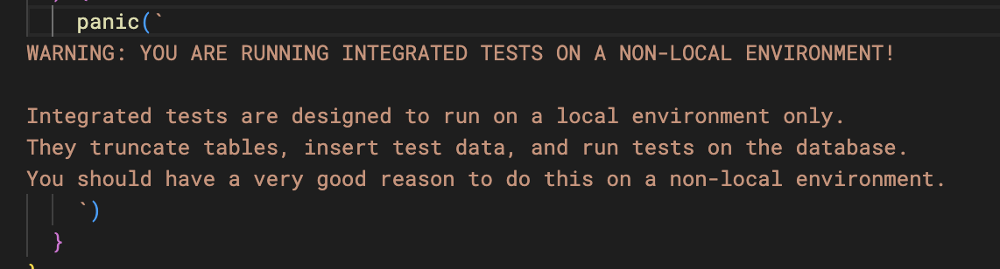

# 채널톡 동사무소

안녕하세요, 채널톡 백엔드 개발자 두기입니다 👋

저는 최근 출시된 [도큐먼트](https://channel.io/ko/documents) 제품을 개발하고 있어요. 직접 서비스를 책임지고 운영하는 것은 이번이 첫 경험이에요. 6월 27일에 공식 릴리즈 된 이후 두 달 정도 지났는데, **운영 단계**의 에피소드와 느낀 점을 정리하는 글입니다. 도큐먼트를 포함한 채널톡이라는 서비스는 다른 기업이 사용하는 B2B 제품이기 때문에 사용자의 요청이나 문의, 클레임이 B2C 제품에 비해 복잡하고, 사용자의 문제를 잘 파악해서 해결해야 하는 부분이 많다고 생각해요. 특히 채널톡에서는 고객 문의(유저챗)에 개발자나 제품팀 멤버들이 초대되어 문의를 직접 해결하기도 합니다. 그래서 이번 편은 사용자의 직접 문의(민원)를 해결하는 동사무소 컨셉이에요.

꼭 도큐먼트 제품에서 발생한 상황은 아니고, 이전에 다른 사례의 예시를 참고하기도 했으며, 적당한 각색을 통해 재구성했으니 참고해주세요!

> 이번 동사무소 편의 이전 시리즈인 "채널톡 탐정사무소" 글이 궁금하다면?
>
> - [채널톡 탐정사무소](https://channel.io/ko/blog/tech-backend-be-detective-office)

## 모든 사용자 데이터 변경에는 흔적이 남아야 한다

어느 날 굉장히 다급해 보이는 사용자 한 명이 찾아왔어요.

"제가 이것저것 만지다가 아티클(글)이 다 날아간 것 같아요 ㅠㅠ 혹시 어떻게 복구할 수 있는 방법이 없을까요? 😭"

정말 영구 삭제를 했다면 복구가 어려울텐데.. 라고 생각하며 두기는 이 때를 위해 준비한 audit log(데이터 변경 이력)을 조회해보았어요. 그런데 이 사용자에게는 아티클을 영구 삭제한 이력이 없었어요.

이상함을 느낀 두기는 사용자에게 몇 가지 물어보았고, 알고 보니 이 사용자는 글을 삭제한 것이 아니라, 그냥 메인 화면에서 노출이 안되게 숨겨놓았던 것이었어요(관련 설정값을 바꾼 이력도 있었구요). 이렇게 저렇게 하면 다시 숨김이 해제된다고 알려드렸고, 결과는 해피 엔딩!

데이터 변경 이력을 남기지 않았다면 정확하게 어떤 상황인지 파악을 하기 어려웠을거고, 그냥 영구 삭제한 글은 복원이 안돼요 😭 하고 돌려보낼 수밖에 없었을 거에요. 다른 문의가 들어왔을 때도 탐정처럼 주변 엔티티 정보를 관찰하면서 추측만 하는 게 아니라 간단하게 이력 조회로 쉽게 해결이 가능하겠죠?

- 문의가 들어왔을 때 어떤 상황에서 문제가 발생했는지 주변 맥락을 파악해야 하는데, 데이터 변경 이력은 큰 도움이 되었어요.
- **사용자는 자신이 어떤 행동을 했는지 정확하게 설명을 할 수 있는 경우가 드물기 때문에** 맥락을 재구성하려면 꼭 필요한 정보에요.

  

- 문제가 사용자의 액션 때문인지, 우리 코드의 버그 때문인지 구분하는 데에도 유용한 근거로 사용할 수 있어요.

### 데이터 변경 이력 도입기

사실 데이터 변경 이력은 서비스 운영 초반부에 넣을 생각은 아니었어요. (갈 길이 급한데...)

도큐먼트는 6월 말 공식 릴리즈 전 4월에 저희 팀 내부 가이드에 먼저 릴리즈 되었어요. 그런데 릴리즈 된 지 일주일도 안 되어서 가이드 문서에 접속이 안 된다는 리포트가 들어왔어요! 😱

빠르게 확인해보니, **웹사이트 발행 상태가 OFF로 변경되어 있었어요.** 누가 테스트하거나, 데모를 보여주다가 OFF로 돌리고 까먹고 가버린 거죠. 원래 운영용 채널에서는 테스트나 데모를 하면 안 되고 이걸 위한 공간이 따로 준비되어 있지만, 항상 지켜지기를 기대하기는 어려운 일이죠.

이런 일을 다시 겪기 싫었던 두기는 결국 데이터 변경 이력 (audit log) 기능과 권한 세분화 기능을 빠르게 구현해두었어요. 다행히 코드상으로는 아래와 같은 패턴을 사용해서 깔끔하게 들어갈 수 있었네요!

```go
/* 인터페이스 */
type MyService interface {
  // 데이터 변경 이력과 권한 체크가 되어야 하는 오퍼레이션
  VeryImportantOperation(ctx context.Context, params VeryImportantParams) (VeryImportantResult, error)
}

/* 실제 구현 (비즈니스 로직) */
type myServiceImpl struct {
  // ...
}

func (svc *myServiceImpl) VeryImportantOperation(ctx context.Context, params VeryImportantParams) (VeryImportantResult, error) {
  // 여기에는 비즈니스 로직만 가지고 있음
}

/* Audit log 기능으로 감싼 서비스 */
type auditLogEnhancedMyService struct {
  inner MyService
  // ...
}

func (svc *auditLogEnhancedMyService) VeryImportantOperation(ctx context.Context, params VeryImportantParams) (VeryImportantResult, error) {
  // 내부 서비스 호출
  res, err := svc.inner.VeryImportantOperation(ctx, params)
  if err != nil {
    return res, err
  }

  // 여기에서 audit log 기록
  auditLogSvc.Record(ctx, "VeryImportantOperation", map[string]interface{}{
    "params": params,
    "result": res,
  })

  return res, err
}

/* ... 비슷하게 권한 체크도 처리 ... */

/* Dependency Injection 단계에서 서로 wiring 해주기 */
var Option = fx.Options(
  fx.Provide(fx.Annotate(NewMyService, fx.ResultTags(`name:"MyService.0"`))),
  fx.Provide(fx.Annotate(EnhanceWithAuditLog, fx.ParamTags(`name:"MyService.0"`))),
)
```

### 관련 사례

앞선 경우는 저희 팀에서 겪었던 사례지만, 비슷하게 팀원 간 커뮤니케이션 미스나 실수로 문제가 발생하는 경우가 많아요.

- 영구 삭제를 직접 했는데, 다시 문의해서 복원해달라고 요청
  (안 되는 것이 원칙이지만, 가끔 가능할 때 해결해주면 굉장히 고마워함)
- 고객사의 수천 개 데이터가 갑자기 사라졌는데 범인을 모름. 사실 범인은 고객사의 누군가가 퇴사하면서 지우고 나간 것이었음. 심지어 "한 번에 삭제" 기능도 아니고 수천 건을 하나하나 삭제하고 나가서 눈치채기 어려웠음
- 고객사의 한 팀원이 어떤 설정값을 변경했는데, 그 옆자리 팀원이 문의해서 누가 변경했는지 물어봄. (누가 바꿨는지 알려드리고 원만히 합의 보시라고 안내) 서로 대화 좀 하세요..

## 백오피스 도구를 준비하자

### 읽기 전용 데이터베이스와 쿼리 시각화 도구

10. 일단 개발자가 직접 운영 DB에 접속해서 쿼리를 날리는 게 일반적인 습관으로 자리잡는 것은 아주 나쁜 생각임

- https://techblog.woowahan.com/2645/ 를 읽어보길 바람
- 안전한 데이터 조회를 위해 read replica를 운용하고 있음

11. 이것에 더해 쿼리 시각화 도구 (Redash) 를 사용하고 있음

- 개발자들이 redash에서 쿼리를 날려보면서 개발과 디버깅을 하는 것이 일상적
- 주의: Redash에서 수십 분 걸리는 쿼리를 실행하는 것은 위험

  - PostgreSQL에서 read replica의 트랜잭션도 master의 vacuum이 작업 실행을 막기 떄문
  - Vacuum이 수십 분 이상 돌지 않을 경우 write가 많은 테이블에서 성능 문제가 생기기 시작함

12. Redash는 시각화 기능도 가지고 있지만, 굳이 기능을 사용하지 않더라도 충분히 유용함

- SAML을 연결할 수 있고
- 자주 사용하는 쿼리를 저장해두거나
- 데이터 export 기능을 편리하게 이용하고 있음

13. 쿼리 시각화 (대시보드)

- SQL을 몰라서 직접 쿼리를 짤 수 없는 팀 멤버도 주요 지표를 확인할 수 있음
- 서비스 초기부터 핵심 지표를 정해두고 Redash에 대시보드로 만들어둠 -> 매주 리포트를 공유 (리포트 쓰는데 15분밖에 안 걸림)

Redash는 백오피스 툴 중에서 가장 팀에서 일상적으로 사용하고 있는 듯.

14. 물론 (백엔드팀 Admin Cell과 웹 클라이언트 팀에서 개발한) "진짜" 백오피스도 있음

- 아직 우리 팀에서 운영하는 기능과 연결이 안되어있음
- 효과: CX팀에서 직접 고객 문의와 관련된 맥락을 파악 못하고 개발자에게 하나하나 문의해야 함 -> 개발자 한 명이 하루에 30분씩 시간 쓰는 요인
- 백오피스에서 개발자가 아닌 사람이 엔티티를 읽고 검색할 수 있으면 나는 하루에 30분씩 획득

## 데이터베이스 백업과 복구

이건 다행히 실제 운영단계는 아니고 개발 스테이징 서버의 에피소드에요.

같이 도큐먼트를 개발하는 클라이언트 팀원이 갑자기 개발 서버에 테스트 중이던 데이터가 다 사라졌다고 멘션을 줬어요! 화들짝 놀란 두기는 빠르게 확인해봤는데, 진짜 데이터가 날아갔고 심지어 그 팀원이 보던 데이터 뿐만이 아니라 **전체 데이터베이스가 날아간 것이었어요!** 😱😱😱


나중에 쿼리 실행 로그를 보고 원인은 찾으면 되고, 그 전에 데이터베이스 복구를 해야겠죠. 다행히 저희 데이터베이스는 Amazon RDS 상에서 운영되고 있고, 스테이징 환경에서는 매일 자동으로 PITR 백업이 기록돼요. PITR 백업을 그대로 쓸 수는 없었어요(그 인스턴스의 모든 데이터베이스가 PITR 시점으로 리셋되는건데, 저희 데이터베이스만 날아간 것이었거든요). 하지만 PITR로부터 새 인스턴스를 띄운 후 pg_dump로 데이터를 덤프 뜨고, 원래 인스턴스에 데이터를 밀어넣으니 복구 완료!

사실 원인은 개발 환경에 붙어서 테스트 코드를 돌리다가 통합 테스트 코드의 truncate (`TRUNCATE TABLE {table_name} CASCADE`) 로직이 스테이징 데이터베이스에서 돌아간 것이었어요. 통합 테스트는 매번 테스트 데이터베이스를 초기화하고 실행하기 때문이죠. 코드상으로 실수가 발생할 수 있어보여 통합 테스트는 로컬 호스트에 대해서만 돌릴 수 있도록 방어 로직을 추가했어요.

<figure>
  
  <figcaption>(대문짝한 경고 문구)</figcaption>
</figure>

- PITR로 복구가 가능한 건 머리로 알고 있었는데, 직접 복구하는 과정을 경험해보았어요! (개발자 업적 달성 🎉)
- 실제 서비스였다면 PITR만으로는 부분적인 데이터 손실이 있어 추가적인 작업도 진행해야 할 거에요. 그리고 다른 마이크로서비스와의 정합성 오류도 체크 해야겠죠.

## Admin

18. 개발자의 업무 시간을 잡아먹는 것은 Administration

- 토이프로젝트만 해 본 뉴비에게 실제 서비스 운영 경험을 꼭 추천하는 이유입니다.

- 많은 서비스에서 코어 비즈니스 로직은 "사실" 그렇게 까다로운 부분은 아닙니다.

  - 제일 중요하기 때문에 제일 잘 만들어두는 부분

  - 가장 좋은 구조로 설계해두고 깔끔

  - 정작 시간에 쫓겨 정밀하지 못한 코드나, 우아하지 못한 구조로 추가하게 되는 부분은 긴급한 버그 픽스나 admin 작업

- 버그로부터 생긴 데이터 부정합 고치기, 고객 요청에 따른 데이터 확인 또는 수정, 신규 기능 추가에 따른 마이그레이션이 개발자의 시간을 잡아먹습니다.

  - 우리 팀의 경우 (B2B SaaS 도메인) 고객 요청이 많고 사용자 문의로 목소리를 직접 듣게 됨

  - 단순 확인 문의부터, 버그가 발생한 상황인지 맥락 확인, 데이터 옮겨주세요, 데이터 부어주세요, 등등

- 중요한 고객의 요청 하나를 해결하는데 일주일 중 3일을 쓰면 안 됨

- 그렇다고 사용자 문의에 귀를 닫게 되면 1차 피드백을 얻을 창구가 사라지고 점점 뇌피셜로 제품을 만듬

- 이 부분을 적은 노력으로 해결해야 내 시간을 절약해서 사용자에게 필요한 기능을 개발하는 데 쓸 수 있습니다.

### Admin API

19. 엔티티에 대한 읽기와 쓰기 API는 항상 만들어둡니다.

- 반복 작업이고 패턴이 있기 때문에, 프레임워크나 code generation을 사용해도 좋을 것 같습니다.

- 이 부분에서 GitHub Copilot에게 많은 도움을 받고 있습니다. 함수 이름만 잘 작성해도 대부분의 코드를 패턴에 맞게 만들어줌

20. 반복적으로 들어오는 요청 해결 위주로

- 운영 데이터베이스에 update 쿼리를 자주 날리고 있다면 그 작업에 대한 admin API가 필요하다는 신호입니다.

- 다시 한번 개발자 머피의 법칙 (https://techblog.woowahan.com/2645/) 글 추천

- Admin API 호출도 사용자 요청과 마찬가지로 audit log가 남아야 합니다.

21. SDK

- 서버사이드에서 Admin API를 만들었으면, 그걸 클라이언트 사이드에서 코드로 호출할 수 있는 SDK도 준비해두는 것이 유용했습니다.

- 클라이언트 사이드 코드도 생성할 수 있는 도구도 많이 있습니다만 (gRPC같은걸 쓴다면 특히) 이런 걸 아직 사용하고 있지는 않습니다.

  역시 GitHub Copilot의 도움을 많이 받고 있음

- 이전 프로젝트에서 복잡한 작업을 셸스크립트로 만들었지만, 셸스크립트에 능숙하지 않아 작업이 턱턱 막히고 비즈니스 로직을 활용하지 못하는 점이 아쉬움이었습니다.

- 스크립트가 메인 프로젝트와 동일한 repository에서 코드와 비즈니스 로직을 공유할 때 다양한 작업을 처리할 수 있구나 생각했습니다. (메인 애플리케이션과 스크립트를 모노레포로 구성)

### 재사용 가능한 스크립트

22. 결과적으로, Admin API와 모노레포 구조를 통해 복잡한 로직을 담은 스크립트를 30분 내에 뚝딱 작성할 수 있게 되었습니다.

- 데이터 스캔하면서 통계값을 뽑기

- 데이터 정합성 맞추는 마이그레이션 스크립트

- 외부 데이터를 import 혹은 export

- Secondary database로의 전체 혹은 부분 데이터 동기화

23. 스크립트 작성하고 돌리며 했던 실수

- 원래 운영 환경에서 로그가 warn 이상 레벨이었는데, 스크립트에서 출력하는 로그는 info레벨이었기 때문에 로그를 못 보고 스크립트가 끝날 때까지 기다렸던 적이 있습니다.

  - 사실 이것 외에도 운영 환경의 "서버"와 "스크립트"는 살짝 configuration이 다르기 때문에 환경을 구분하는 것이 맞는 선택이었음

- 마찬가지로 스크립트에서 발생한 에러가 이슈 추적 도구(sentry와 datadog 등)에 운영 서버와 동등하게 추적되어 혼란을 주었던 문제

- 중간에 에러가 발생했을 때 에러 로그를 출력하긴 했는데 어떤 데이터에서 에러가 발생했는지를 같이 출력 안해서 찾는데 고생

24. 로그

- 스크립트에서 progress 로그를 print하지 않으면, 스크립트를 실행하는 순간..

  - 돌고 있는건지 어딘가에서 막혀있는건지.. 구별이 안됨

- 로그에 정보를 되도록 많이 담아야 잘못 돌았을 때 실수를 커버할 수 있습니다.

- Dry run 옵션

  - 운영환경 데이터에 개발환경과 다른 문제가 있을 수도 있음

  - 단순히 개발환경에서 충분히 많은 케이스를 테스트를 못했을 수도 있고

  - 데이터 정합성 조건이 변했다던가, 미처 마이그레이션 못한 옛날 데이터라던가, 등등

  - Dry run 옵션을 두고 잘 구현하면 안전하게 테스트 할 수 있음

- Documentation과 스크립트 실행 옵션에 대한 설명을 상세히 달아두면, 내가 휴가 갔을 때도 다른 팀원이 돌릴 수 있는 스크립트가 됩니다.

25. 부수효과

- 다양한 스크립트를 보유하고 있어, 팀에서 기능 QA할 때 쉽게 테스트 환경을 세팅할 수 있게 되었습니다.

- 특히 최근에 릴리즈 한 AI 기반 상담 응대 (RAG) 기능에서 잘 써먹음

### Administration: 정리

26. 스노우볼 굴리기

- 반복적인 작업 처리를 위해 Admin API를 만들어둠

  -> 복잡한 요청들을 거절하지 않고 API 요청 몇 개로 해결

  -> 다시 반복되는 요청 패턴을 Admin SDK와 스크립트로 만들어둠

  -> 스크립트가 여러 개 생기니, 스크립트 템플릿도 만들고 스크립트를 작성하고 돌리기가 쉬워짐

- 패턴화와 내 업무 경험 개선의 반복

- 복잡한 문의 해결을 요구하는 엔터프라이즈 레벨 고객 퀘스트도 깰 수 있게 되어 서비스에 락인 시키고, 서비스 지표에도 도움이 됨

- 일주일에 이러한 요청 두세 개 처리하면서 기능 개발 스케줄에도 문제가 없었다! (휴)

## Reliability

27. 6월 27일 릴리즈 이후 3번의 incident가 있었습니다.

- 2번째 incident 이후 사고 리포트를 쓰기 시작함
- 2개는 도큐먼트 서비스 전체 오류 (다 합해서 40분 정도.), 1개는 데이터 정합성 오류 및 내부 데이터 일부 손실

28. 실수를 할 수 있음: '모든' 실수를 개발과 테스트 단계에서 잡고 가려 하면 일정을 맞추는 것이 불가능합니다.

- 그럼에도 불구하고 개발과 테스트 중 바로잡는 것이 가장 저렴하긴 함
- 95%를 99% 완성도로 만드는 것보다 99%를 99.9%로 만드는 것에 드는 비용이 기술적으로 더 비싸니까, 나머지 1% 완성도는 깔끔한 사고 수습을 통해 채워나가자
- 실수를 두려워해서 모든 코드를 팀 리더(a.k.a. 사고났을 때 책임지는 사람)가 리뷰하고, 새로운 기술 도입에 소극적이고, 기능 릴리즈를 늦게 하는 것이 아니라, 실수해도 빠르게 바로잡을 수 있는 환경을 만들자

29. 그럼에도 불구하고 1) 실수 한 것을 최대한 빨리 인지 2) 고객에게 장애 발생을 전파 3) 이유와 복구 상황을 설명 4) 실수를 수습하는 과정 이 깔끔하면 좋겠습니다.

- 40분이나 service outage된 것이 아쉬움
  - 지금 릴리즈 한 지 2달 정도 됐으니 약 99.95% availability (?) 오히려 좋아
- 첫번째 사고는 4분만에 고쳤는데 나머지 하나 전체 장애 때는 인지하는 데 30분 걸림
- 정합성 문제는 겉으로 볼 때 정상적으로 돌아가는 것처럼 보이니 더 찾기 어려웠고, 하루 만에야 뭔가 잘못되었다는 것을 찾음
  - (당연하겠지만) 실수한 걸 빨리 찾을수록 수습이 쉬움
  - 1시간만에 찾았으면 데이터 몇 개 보정할 걸 하루만에 찾아서 몇백 개를 보정하느라 고생

### 사고 리포트

30. 1번 사고

- 사용자의 입력을 충분히 검증하지 않아서 발생한 문제
- 3번째로 추천 글: https://techblog.woowahan.com/2645/ 를 읽어보기 바람
- 서비스 출시 초기라 서버에 적은 리소스가 할당되어 있었는데 (RAM 500MiB짜리 아주 작고 귀여운 서버), 너무 큰 입력을 잘 처리하지 못해 OOM 발생
- 서버 프로세스가 다중화되어 있었지만, 사용자가 너무 큰 입력을 담은 요청을 보내면서 우리 서버를 차례차례 암살 🔪
- 당시에는 1) 서버 리소스를 늘려서 즉시 대응 하고, 이후 수습 과정에서 2) 사용자 입력을 검증하는 한편 3) 이미 데이터베이스에 들어온 너무 큰 데이터들을 정리하는 스크립트를 통해 해결

31. 2번 사고

- 서버 프로세스 자체는 healthy 였음
- 그런데 서버 애플리케이션으로부터 데이터베이스로 가는 요청이 모두 실패
- 프로세스가 healthy니까 healthcheck는 통과해서 알람이 울리지 않음 -\_-
- 30분만에 팀 내부 제보로 인지하고 5분 후에 복구 함
- 추후 조치로 healthcheck에서 애플리케이션이 의존하는 다른 외부 서비스의 health도 체크하도록 해야겠다. (준비 중)

32. 3번 사고

- 코드 상의 실수로 비동기로 이루어지는 작업 일부가 손실되는 문제
- 사용자의 기능 사용에는 영향이 없지만, secondary database로의 동기화가 깨지는 문제점
- 동기화를 Apache Kafka나 Kinesis Data Stream처럼 replay 할 수 있는 시스템이었다면 더 간단했겠지만, 그렇게 하고 있지 않았음
- 문제가 발생했던 구간에서 업데이트가 일어났던 데이터를 찾고, secondary database에 다시 부어넣어주는 스크립트를 통해 해결
- 아직 서비스가 작기 떄문에 영향받은 데이터가 적어서 (수백 개 정도) 수동으로 처리했지만, 나중에는 앞서 언급한것처럼 replay 할 수 있는 시스템이 있어야 할텐데
- 그런데 역시 문제는 언제 이런 것들을 도입하는 것이 적절한가의 문제 (a.k.a. 닭잡칼 🐓 vs 소잡칼 🐄)
